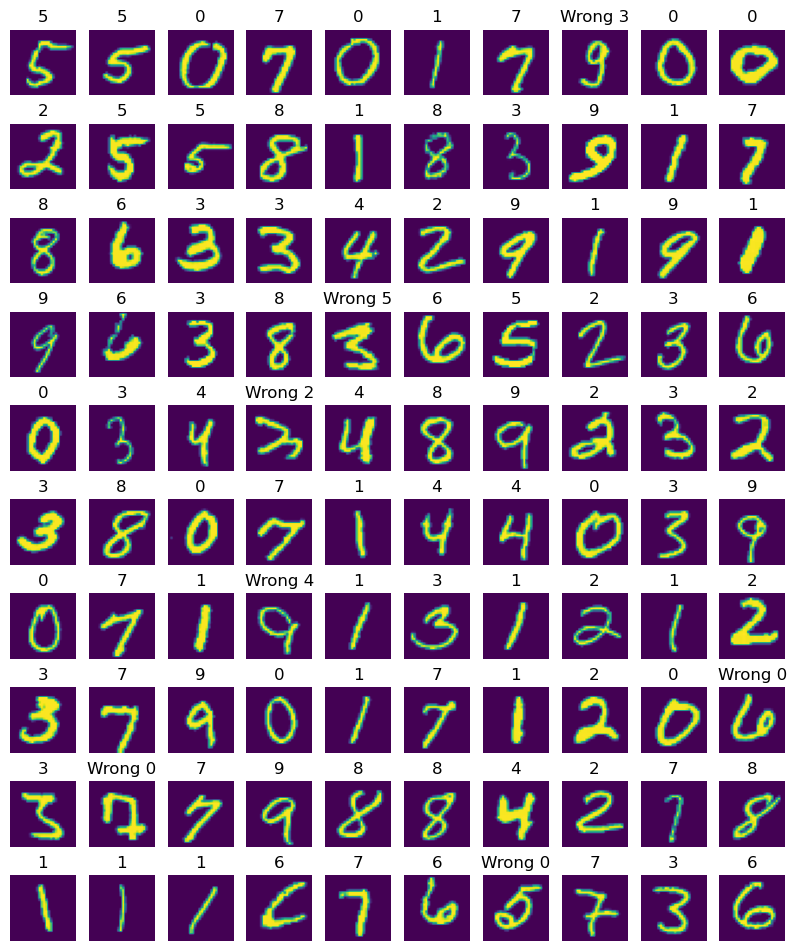

# Network and Optimizers 

This repository offers implementations of Dense Neural Networks built solely with Numpy, along with popular optimization algorithms such as SGD, RMSProp, and Adam. The objective is to explore and analyze the performance differences between these optimizers, evaluating their impact on training efficiency and accuracy in neural network models.

## Project Structure

- **Optimizers_and_their_Convergence**: This contains mathematical details of implementation and working of different algorithms
    as well as analysis of results of experiments. 
- **Experiments Code**: This folder contains the implementation of neural networks.
- **Images**: This folder contains result images and other visualizations.

## Results

Here is a sample result of the network training on MNIST (2 Layer Dense NN with Adam):

Performance of different Optimizers:

